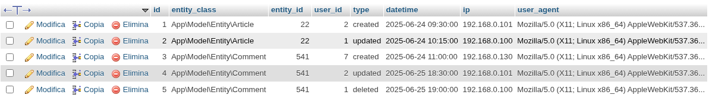

# cakephp-entities-logger

[](https://github.com/mirko-pagliai/cakephp-entities-logger/actions/workflows/ci.yml)



From this screenshot of the table we can see that:
- user `3` created the `Article` entity `2`;
- user `1` then modified it;
- user `2` created the `Comment` entity `36`;
- user `1` then modified it;
- user `5` created the `Comment` entity `37`;
- user `1` then deleted it;

## Installation
You can install the plugin via composer:
```bash
composer require --prefer-dist mirko-pagliai/cakephp-entities-logger
```

Then you have to load the plugin. For more information on how to load the plugin,
please refer to the [CakePHP documentation](https://book.cakephp.org/5/en/plugins.html#loading-a-plugin).

Simply, you can execute the shell command to enable the plugin:
```bash
bin/cake plugin load Cake/EntitiesLogger
```
This would update your application's bootstrap method.

## Create the table
Now you need to create the table that the plugin will use to keep changes to the entities you want.

The best way is using migrations:
```bash
bin/cake migrations migrate -p Cake/EntitiesLogger
```

Instead, if you want to verify that the plugin migrations have been applied correctly:
```bash
bin/cake migrations status -p Cake/EntitiesLogger
```

Alternatively (not recommended) you can run the `sql` code directly:
```sql
CREATE TABLE IF NOT EXISTS `entities_logs` (
      `id` int(11) NOT NULL,
      `entity_class` varchar(255) NOT NULL,
      `entity_id` int(11) NOT NULL,
      `user_id` int(11) NOT NULL,
      `type` varchar(100) NOT NULL,
      `datetime` datetime NOT NULL,
      `ip` varchar(15) DEFAULT NULL,
      `user_agent` text DEFAULT NULL,
  PRIMARY KEY (`id`)
) ENGINE=InnoDB DEFAULT CHARSET=utf8mb4 COLLATE=utf8mb4_general_ci;
```

## Add the behavior

Add the `Cake/EntitiesLogger.EntitiesLog` behavior to the tables you want.

Inside the `initialize()` method of your tables:
```php
namespace App\Model\Table;

use Cake\ORM\Table;

class ArticlesTable extends Table
{
    public function initialize(array $config): void
    {
        // ...
        
        $this->addBehavior('Cake/EntitiesLogger.EntitiesLog');
        
        // ...
    }
}
```